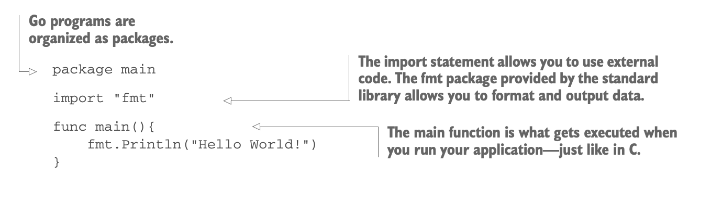
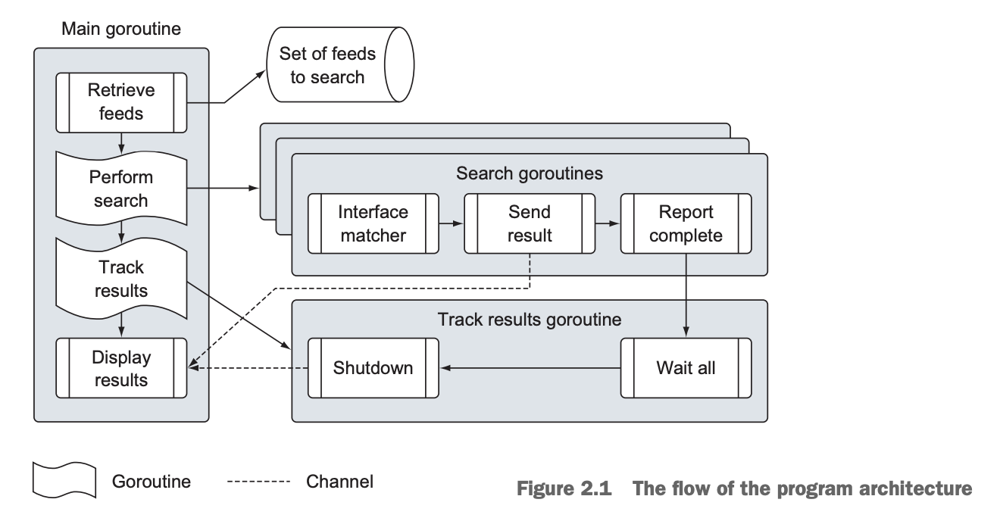
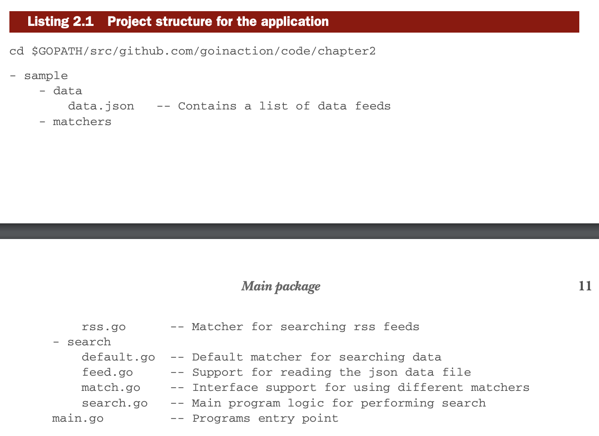

## 1.2) Hello, Go
* This section talks about the basics of Go.
<p align="center">
    
</p>

<p align="center">This is simple program written in go that prints "Hello, World!" to the console.
</p>

``` Go
package main

import (
	"fmt"
)

func main() {
	fmt.Println("Hello, World!")
}
```

## 1.3) Summary
* Go is a modern, fast, and comes with a powerful std library.
* Go concurrency is built into the language, leveraged by goroutines and channels.
* Go uses interfaces as the building blocks of code reuse.

# 2) Chapter 2: Go quick-start

* This chapter is focused on the analysis of a Go program. Found here: [https://github.com/goinaction/code/tree/master/chapter2/sample](https://github.com/goinaction/code/tree/master/chapter2/sample)

## 2.1) Program Architecture

* Here's the program architecture of the sample program.
<p align="center">
    
</p>
<p align="center">
    
</p>

* The program is organized into these four folders, which are listed in alphabetical order.
    * **data**: This folder contains the data files used by the sample program.
    * **matchers**: This folder contains the code that implements the search logic.
    * **search**: This folder contains the code that performs the search logic.
    * **main.go**: This file contains the main package, which is the entry point for the program.

## 2.2) Main Package